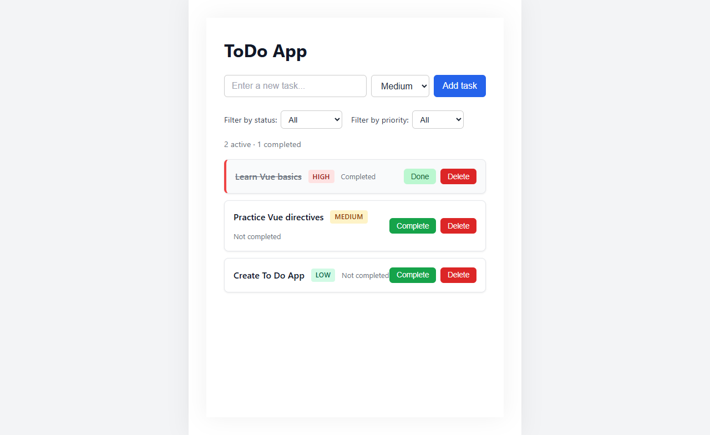
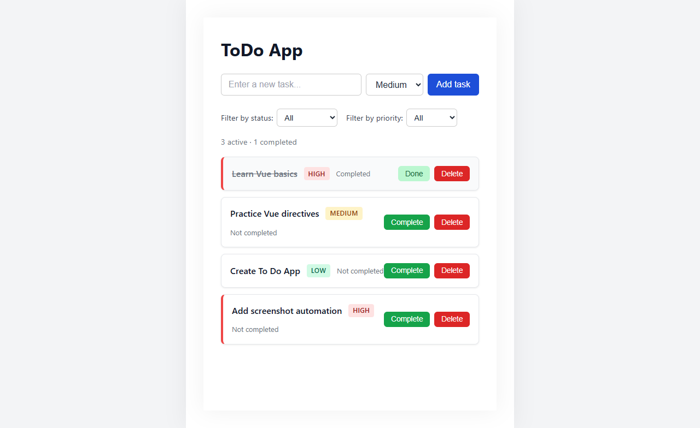
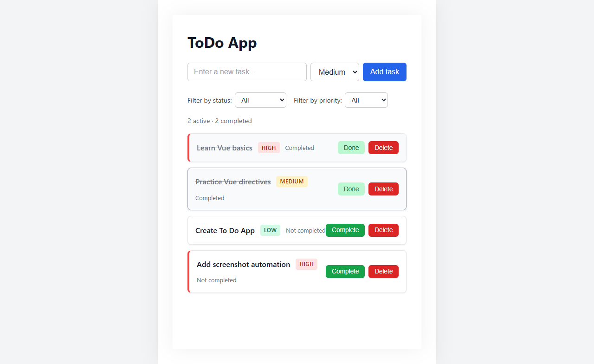
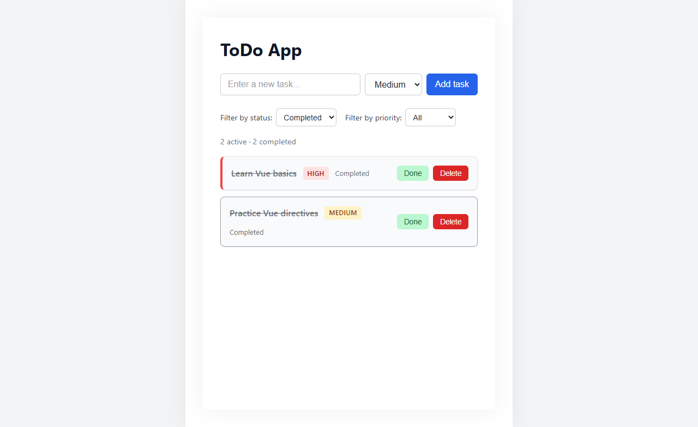
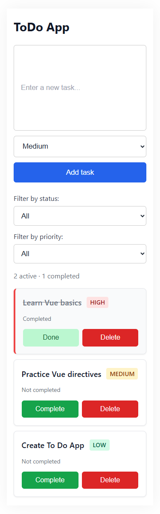

# ToDo App with Local Storage

A lightweight, responsive ToDo application built with Vue 3 and Vite. Tasks are persisted in the browser's local storage, so your todo list survives page refreshes and browser restarts — no backend required.

## Project Description

This application allows users to manage their daily tasks with a clean, intuitive interface. Each task can be assigned a priority level (High, Medium, or Low) and marked as completed. Users can filter tasks by status (All, Active, Completed) and priority. All data is stored client-side using the browser's `localStorage` API, making it a fully standalone, zero-dependency solution.

## Features

- **Add tasks** — Enter a task title and select a priority level
- **Set priority** — Choose between High, Medium, and Low priority levels
- **Complete tasks** — Mark tasks as completed with a single click
- **Delete tasks** — Remove tasks that are no longer needed
- **Filter by status** — View All, Active, or Completed tasks
- **Filter by priority** — Narrow down tasks by priority level
- **Task summary** — Real-time count of active and completed tasks
- **Local storage persistence** — Tasks are automatically saved and restored
- **Responsive design** — Fully functional on mobile and desktop devices

## Tech Stack

| Category         | Technology   |
| ---------------- | ------------ |
| Framework        | Vue 3        |
| Build Tool       | Vite         |
| Language         | HTML, CSS, JavaScript |
| Dev Tools        | Vue DevTools |
| Storage          | Browser Local Storage |

## Installation

### Prerequisites

- [Node.js](https://nodejs.org/) (v22.18.0 or newer)

### Setup

1. Clone the repository:

   ```sh
   git clone https://github.com/adissuceska/ToDo-App-with-Local-Storage.git
   ```

2. Navigate to the project directory:

   ```sh
   cd ToDo-App-with-Local-Storage
   ```

3. Install dependencies:

   ```sh
   npm install
   ```

4. Start the development server:

   ```sh
   npm run dev
   ```

5. Open [http://localhost:5173](http://localhost:5173) in your browser.

### Build for Production

```sh
npm run build
```

## Screenshots

### Main View



### Adding a New Task



### Completing a Task



### Filtering Completed Tasks



### Mobile View



> Screenshots are generated using Playwright. To regenerate, run `node scripts/screenshot.mjs` while the dev server is running.

## Future Improvements

- **Edit tasks** — Allow users to edit existing task titles and priorities
- **Drag & drop reordering** — Reorder tasks via drag-and-drop
- **Due dates** — Add and display task deadlines
- **Task categories/labels** — Group tasks into custom categories
- **Dark mode toggle** — Manual dark/light mode switch (in addition to OS preference)
- **Local storage migration** — Handle data migration across app versions
- **Unit and integration tests** — Add a test suite with Vitest
